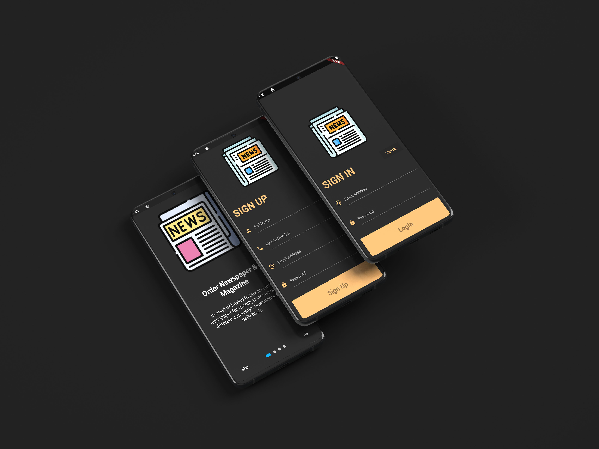
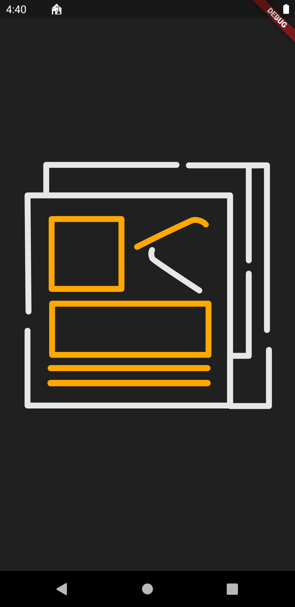
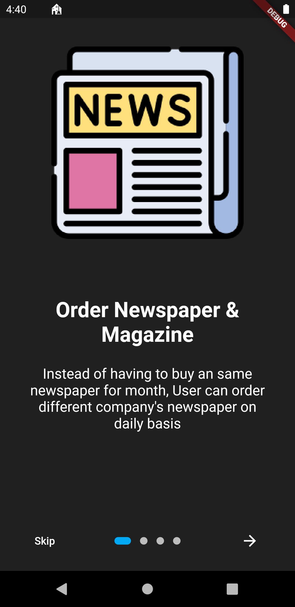
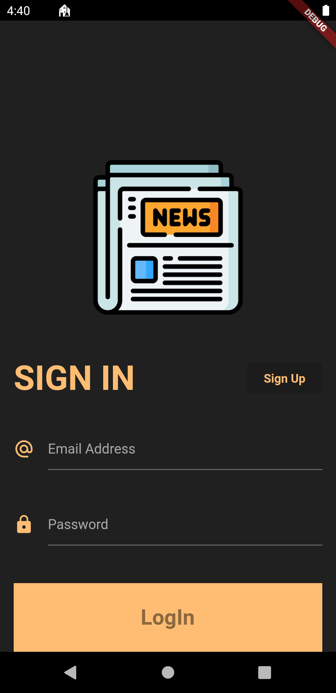
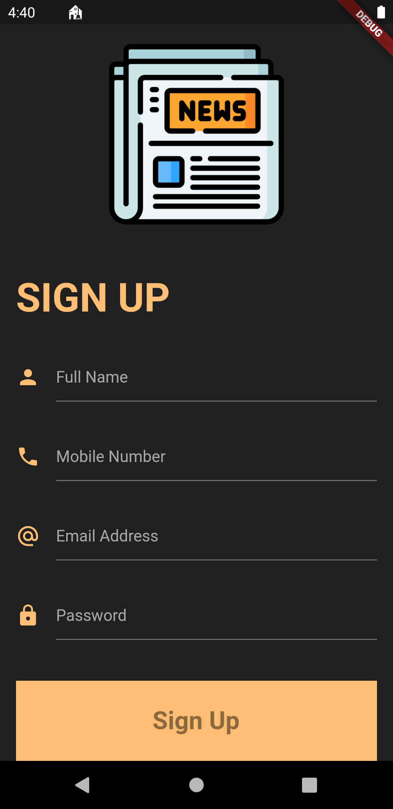

<html>
<body>
<h1>Flutter Firestore Login-Signup App</h1>  

A We design 4 screens first one is a Lottie Animation Screen when user open your app it shows then users have Paper onboarding or Walkthrough, after that if he has an account then he'll use login otherwise press signup button its transfers to the signup screen.

 
 
This application was created to connect flutter with Firebase for authentication of the user and how to use firestore database.

  
  
<h3>Animations used in app</h3>
  <h4><ul>
  <li>Lottie Animation</li>
  <li>Paper onBoarding</li>
</ul></h4>

<h1>Application UI</h1>

 

</body>
</html>
